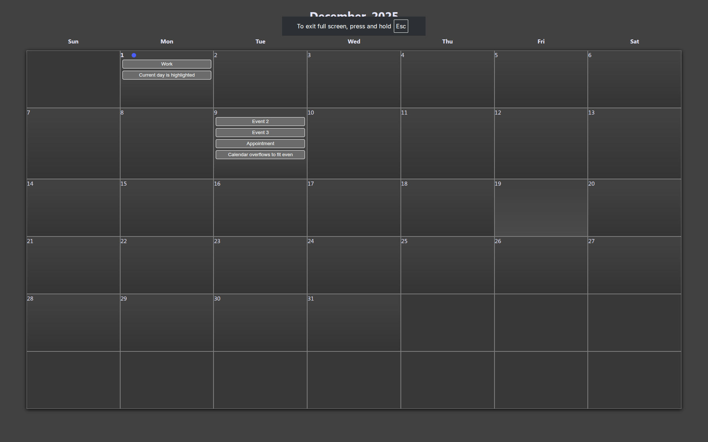

# appointment-project
CPAN113/FJS Group Project

## Purpose
The purpose of this project was to allow users to plan out their time for the month, scheduling appointments, tasks, work, etc.

## Features
There are two main features:
1. Calendar view
    - Displays all the days of the current month, as well as the month.
    - Allows the user to click on a day to add an event, sending them to the event panel.
2. Adding events
    - Allows the user to input an event title, the time, and a description for their event.
    - The user can also cancel, in the case of a miss-click.

### Demonstration Video
Click this preview image to watch the video:

## Installation Instructions
To install, you need to have the following files in your website:
1. All files in the 'js' folder
2. index.html
3. styles.css

## The Team

- Mirza
- Stanley
- Ethan
- Prabu